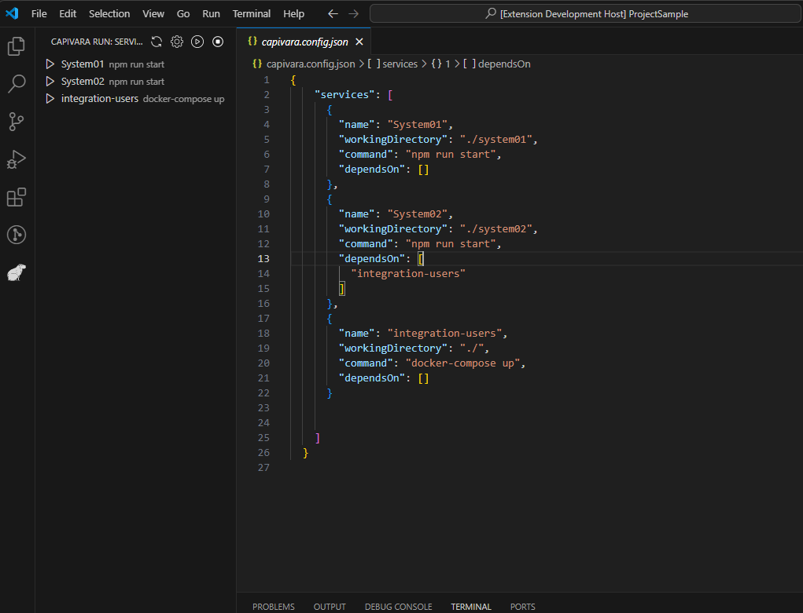

<p align="center">
  
</p>

# CapivaraRunner - VS Code Extension

**CapivaraRunner** is a Visual Studio Code extension that allows you to manage and run services defined in a `capivara.config.json` file. With it, you can start and stop services, as well as manage dependencies between them.

## Features

- **Start and Stop Services**: Run or stop services directly from Visual Studio Code.
- **Dependency Management**: The extension ensures that services are started and stopped in the correct order, respecting defined dependencies.
- **Auto-Reload Configuration**: Easily reload the configuration whenever the configuration file changes.

## Preview

Here’s a preview of the **CapivaraRunner** extension in action:

<p align="center">
  
</p>

## Installation

1. Install the extension directly in VS Code or clone the repository and run the following commands:
    ```bash
    npm install
    npm run compile
    ```

2. Add a `capivara.config.json` configuration file in the root of your project.
3. An example project with a configuration file is available in the `./example` folder of this repository.

## Configuration
### Configuration File (`capivara.config.json`)

The configuration file should follow this format:

```json
{
  "services": [
    {
      "name": "System01",
      "workingDirectory": "./system01",
      "command": "npm run start",
      "dependsOn": []
    },
    {
      "name": "System02",
      "workingDirectory": "./system02",
      "command": "npm run start",
      "dependsOn": ["integration-users"]
    },
    {
      "name": "integration-users",
      "workingDirectory": "./",
      "command": "docker-compose up",
      "dependsOn": []
    }
  ]
}
```
### Global Configuration in VS Code

If the `capivara.config.json` file is not found, the extension will look for global configurations in the VS Code `settings.json` file, using the project name as the identifier.

**Example of configuration in `settings.json`:**
```json
"capivaraRunner.projects": {
        "projectsample":{
            "services": [
                {
                  "name": "System01",
                  "workingDirectory": "./system01",
                  "command": "npm run start",
                  "dependsOn": []
                },
                {
                  "name": "System02",
                  "workingDirectory": "./system02",
                  "command": "npm run start",
                  "dependsOn": [
                    "integration-users"
                  ]
                },
                {
                  "name": "integration-users",
                  "workingDirectory": "./",
                  "command": "docker-compose up",
                  "dependsOn": []
                }
            ]
        },
    }
 ```
 ####  In the example above:
- The key (e.g., my-project) matches the workspace name in VS Code.
- You can configure multiple projects, and the extension will load the configuration for the active workspace

 #### Configuration Properties
- `name`: The name of the service.
- `workingDirectory`: The directory where the command will be executed.
- `command`: The command to run the service.
- `dependsOn`: A list of services this service depends on.

### 3. Configuration Hierarchy
1. **Highest Priority**: Configuration from the `capivara.config.json` file.
2. **Second Priority**: Global configuration in the VS Code `settings.json` file.

## Usage
### Available Commands
- **Start Service**: Starts an individual service.
- **Stop Service**: Stops a running service.
- **Start All Services**: Starts all services while respecting their dependencies.
- **Stop All Services**: Stops all running services.
- **Refresh**: Reloads the configuration from the `capivara.config.json` or `settings.json` file.

### Managing Services

Once the extension is activated, you’ll see a tree view in the Activity Bar where you can start or stop services by clicking the "play" or "stop" icon next to each service.

### Terminal Execution

Commands can be executed in independent terminals or in a dedicated output channel called **CapivaraRunner Output**.

## Shortcuts

- **CapivaraRunner: Refresh Configuration**: Reloads the configuration. Shortcut: `Ctrl+Shift+P` and select `CapivaraRunner: Refresh`.

## Deactivation

When VS Code is closed or the extension is deactivated, all running services are automatically stopped.

---

## Contribution

Feel free to contribute to the extension. Fork the project, add your improvements, and open a pull request!

## License

This project is licensed under the MIT License.